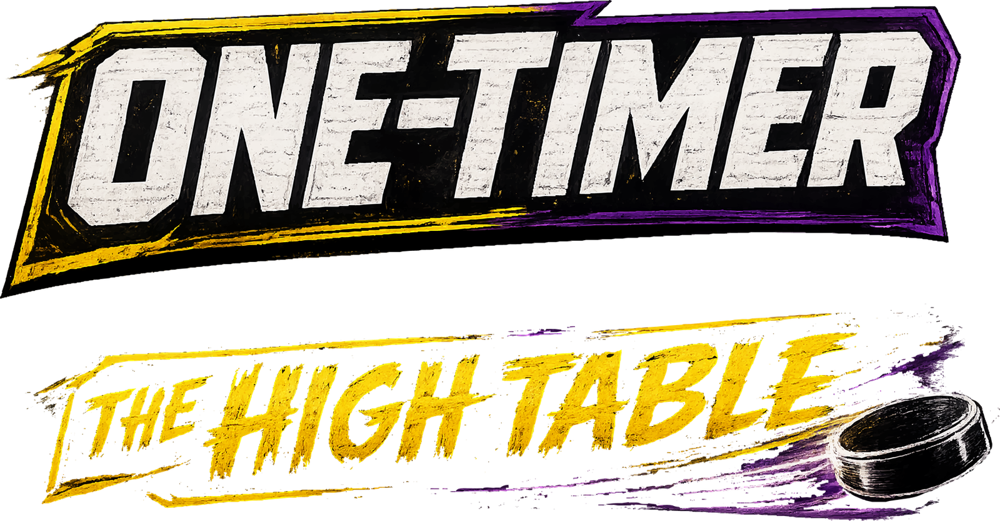

## ▶ [PLAY IT IN YOUR BROWSER][play]

Side-view air hockey on a blacklight table. A Castle Killscreen game by Anders &
Partners LLC.

Move the mouse to steer. Hold **left-click** to trap the puck, **right-click**
to blast. Get it in the far goal.

## Modes

[1UP arcade][play] · [Campaign][camp] · [Castle rules][castle] ·
[Jailbreak][jail] · [2 players][twoup] *(work in progress)* · [Top-down][todown] ·
[Table picker][picker] · [The garage][garage]

The campaign is the one that keeps progress: clear its tables and the cabs in the
garage unlock. That progress, and your control and sound settings, are kept in
your own browser and never sent anywhere.

## Controllers

Set the pad to X-input. On an 8BitDo, also set the lever to D-pad. A is trap,
B is blast, RT is get big.

## Credits

Created by **Joseph Coleman**, with Claude and ChatGPT.
A Castle Killscreen game by Anders & Partners.

Music & SFX by **Taylor Lyons** and **Joseph Coleman**.

---

Generated from the private Castle Killscreen tree. Edit there, not here.

RESPEK LOGIC ART UREA

[play]: https://anderspartnersck.github.io/high-table/
[camp]: https://anderspartnersck.github.io/high-table/?camp
[castle]: https://anderspartnersck.github.io/high-table/?castlerules
[jail]: https://anderspartnersck.github.io/high-table/?jail
[twoup]: https://anderspartnersck.github.io/high-table/2up.html?solo
[todown]: https://anderspartnersck.github.io/high-table/table_temp_engine.html
[picker]: https://anderspartnersck.github.io/high-table/arcade.html
[garage]: https://anderspartnersck.github.io/high-table/garage.html
