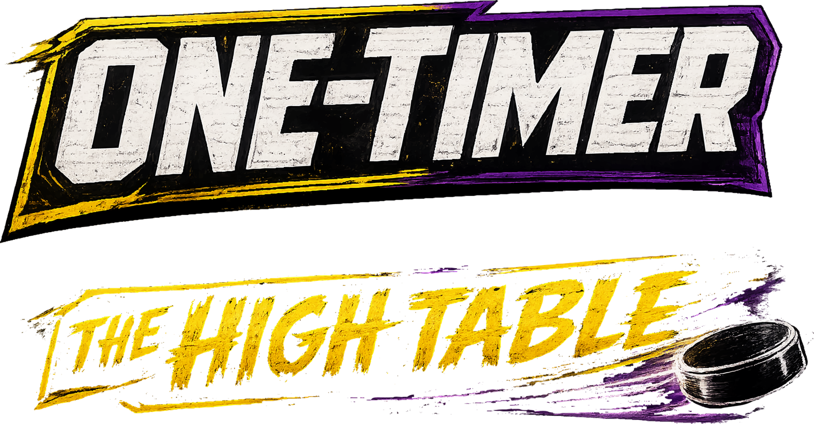

## ▶ [PLAY IT IN YOUR BROWSER][play]

*Just like Old-Tymes.*

Grab your best knocker and get ready to blast away in side-view or top-down,
breakaway-speed air hockey. Take your Throne as the **Valley Queens**, or win one
for the Hivemind as the **Cohasset Bees**, at one of many venerable venues: the
RIVALRY TABLE, HYSCORE FOREST, the HONEY HOLE, the THRONE ROOM, or the HIGH TABLE
itself. Penalty Box Nachos is for true TURBO APEX game speed.

A Castle Killscreen game by Anders & Partners LLC. Free, in your browser, nothing
to install.

## How to play

Your knocker is the near one. Score in the far goal.

**On a phone,** turn it sideways.

- Drag on the table to steer.
- Left thumb: **TRAP** catches the puck and winds up a shot for as long as you
  hold it. **GET BIG** lights up when your meter is full.
- Right thumb: **BLAST** lunges forward and knocks the other knocker flat, or
  fires the puck you've trapped. Its ring shows when it's ready again.
- Rather use a stick? Tap **STICK** in the top corner for an 8-way thumbstick,
  and all three buttons move to your right thumb.
- Tap ❚❚ to pause.
- In Safari, tap Share, then **Add to Home Screen**. It opens full-screen like
  an app, and after your first game it plays offline.

**On a computer:**

- Steer with the mouse, WASD or the arrow keys.
- Hold the mouse button or **Z** to TRAP · **X** to GET BIG · **C** to BLAST.
- **P** or Esc pauses. **M** switches between colour and black-and-white.
- Two players on one keyboard: press **P** on the title screen. Player 2 steers
  with O K L ; and uses comma for GET BIG, period for BLAST.

## Ways to play

- [HYSCORE][play]: the house cab at HYSCORE, the arcade off the 101 in the
  Valley. A quarter-eater: it runs its attract until you drop a quarter, then
  you play it out and run it back or walk.
- [CAMPAIGN][camp]: the Old-Tyme climb. Win a series on each table to reach the
  next, all the way up to the High Table.
- [CASTLE RULES][castle]: three timed periods. Most goals at the horn wins; a tie
  goes to sudden death.
- [JAILBREAK][jail]: the cab behind the velvet rope. Every table, knocker and
  puck, open from the start, plus **RAISE IT!**, a best-of-seven gauntlet
  against a CPU that keeps getting better, for the Breakaway Cup.
- [2 PLAYER][twoup]: split screen, each player at their own end of the table.
  P1 steers with WASD and plays Z / X / C; P2 steers with O K L ; or the arrows,
  comma for GET BIG, period for BLAST. Two pads work too.
- [TOP DOWN][todown]: the same game from overhead. Steer with the mouse, or drag
  on a phone.

Every table has its house knockers. Pick your own and the table brings the
other end.

Your progress and settings are kept in your own browser and never sent
anywhere.

## Controllers

Set the pad to X-input. On an 8BitDo, also set the lever to D-pad. Then press
**START** and turn on **STICK** in the pause menu.

**A** is TRAP · **B** is GET BIG · **RT** is BLAST · **START** pauses.

## Credits

Created by **Joseph Coleman**, with Claude and ChatGPT.
A Castle Killscreen game by Anders & Partners LLC.

Music & SFX by **Taylor Lyons** and **Joseph Coleman**.

---

Generated from the private Castle Killscreen tree. Edit there, not here.

RESPEK LOGIC ART UREA

[play]: https://anderspartnersck.github.io/high-table/
[camp]: https://anderspartnersck.github.io/high-table/cab_intro.html?cab=1up%20HIVEMIND%20color&game=side.html%3Fcamp&title=CAMPAIGN
[castle]: https://anderspartnersck.github.io/high-table/?castlerules
[jail]: https://anderspartnersck.github.io/high-table/cab_intro.html?cab=OTTHT_1%20up%20HYSCORE%20violet&game=side.html%3Fjail&title=JAILBREAK
[twoup]: https://anderspartnersck.github.io/high-table/cab_intro.html?cab=RIVALRY%20A%20color&game=2up.html%3Fsolo&title=2%20PLAYER
[todown]: https://anderspartnersck.github.io/high-table/table_temp_engine.html
